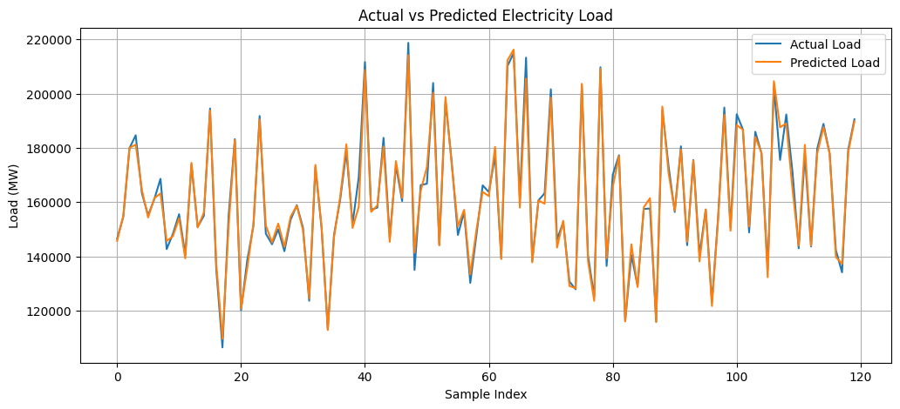
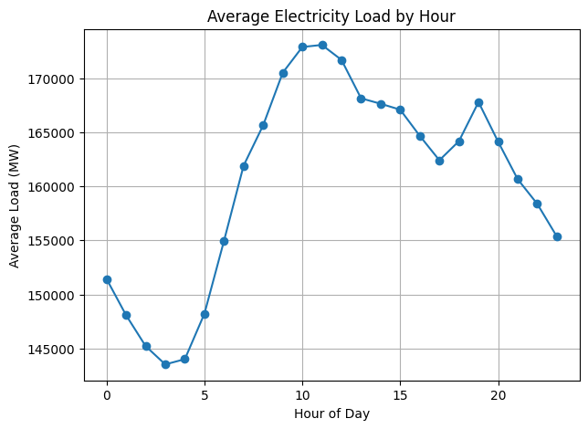

# ⚡ Electricity Load Forecasting

## 📌 Overview
This project predicts short-term electricity demand using historical time-series load data.  
A machine learning regression model is used to analyze consumption patterns and forecast future electricity load for better energy planning and smart grid applications.

---

## 🎯 Objectives
- Analyze historical electricity demand  
- Perform time-based feature engineering  
- Train a regression model for load prediction  
- Visualize actual vs predicted load  
- Evaluate model performance  

---

## 📂 Dataset
The dataset contains hourly electricity demand values.  
Preprocessing includes datetime conversion, feature extraction (hour, day, month, year), handling missing values, and train-test splitting.

---

## 🤖 Model Used
- Random Forest Regressor  

---

## 📊 Results

### Actual vs Predicted Load

### Hourly Load Trend

The model captures general demand patterns and provides reasonable short-term forecasting performance.

---

## 📈 Evaluation Metrics
- Mean Absolute Error (MAE)  
- Mean Squared Error (MSE)  
- R² Score  

---

## 🛠 Tech Stack
Python • Pandas • NumPy • Matplotlib • Scikit-learn • Jupyter Notebook  

---

## 🚀 Future Scope
- Add weather features  
- Try advanced ML / DL models  
- Hyperparameter tuning  
- Real-time forecasting dashboard  

---

## 👨‍💻 Author
Aryan Shishodia  
B.Tech Student | Machine Learning Enthusiast  

⭐ Star this repo if you like the project.